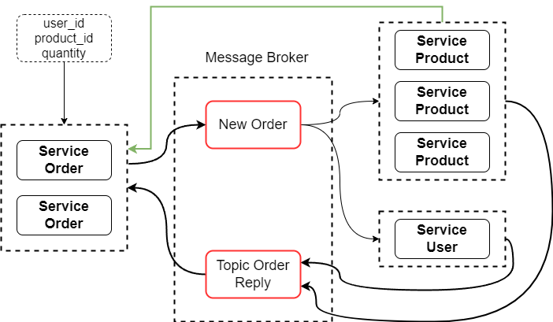

# Implement Microservice Architecture

This project for learning microservice architecture with combine another tech stack

## Features

- Support GRPC and REST API
- Event Driven With Kafka
- Client Side LoadBalancing
- Service Discovery
- Docker Container

## Architecture

### Flow Asynchronous Create Order With Event Drivent

## Tech Stack
**Database:** [Postgres](https://www.postgresql.org/)

**Container:** [Docker](https://www.docker.com/)

**Service Discovery:** [Consul](https://www.consul.io/)

**Protocol:** [GRPC](https://grpc.io), [REST](https://github.com/gin-gonic/gin)

**Message Broker Server:** [Apache Kafka](https://kafka.apache.org/)

**Go Kafka Client:** [IBM/sarama](https://github.com/IBM/sarama)

## 🔗 Links

